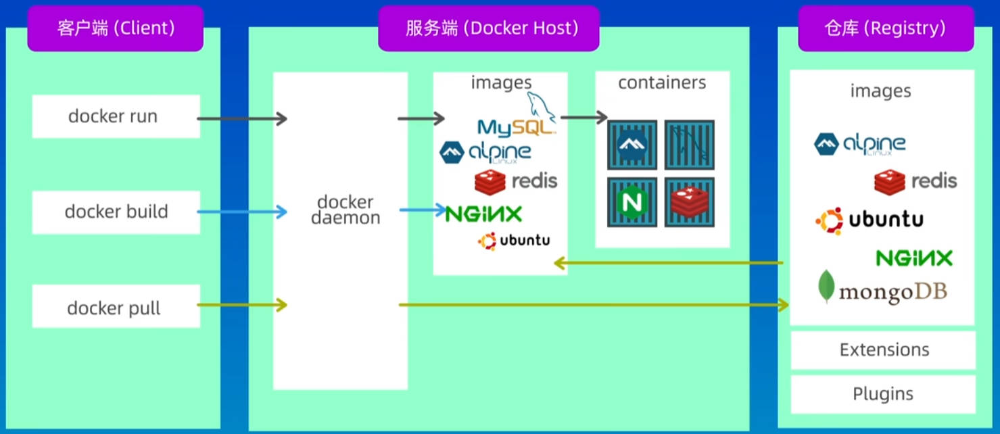

# Docker 介绍

## 一、Docker 简介

Docker 是一个用于构建（build）、运行（run）、传送（share）应用程序的平台。

Docker 将应用程序，和它运行时所需要的各种依赖包、第三方软件库、配置文件......打包在一起，以便在任何环境中都可以运行。

现有一个软件，前端使用 Vue 构建，后端使用 SpringBoot 构建。数据库使用 MySQL。

如果该软件要正常运行，则需要以下的环境、配置：

- NodeJS 环境，
- 各种 npm 依赖包。
- Vue 的环境变量、启动脚本
- Java 运行时环境。以及 SpringBoot 的第三方依赖。
- MySQL 数据库配置
- Redis 缓存配置。
- Nginx 负载均衡配置。
- 其它微服务框架......。

Docker 可以将以上配置和环境，全部打包在一个“集装箱”中，只要能在本地环境运行成功，在其他环境也能运行成功。

## 二、虚拟机是什么？

虚拟机，可以创建完整的操作系统，并在该系统中运行应用程序，

虚拟机，是通过虚拟化（Hypervisor）技术实现的，

- 虚拟化（Hypervisor）技术，可以将物理资源，虚拟为多个逻辑资源。也就是说，可以将物理服务器，虚拟为多个逻辑服务器，
- 每个逻辑服务器，都有自己的操作系统，其中有 CPU，内存，硬盘、网络接口...，它们之间是完全隔离的，可以独立运行。

虚拟机一定程度上实现了资源的整合，但缺点也很明显：

- 每台逻辑服务器，都需要占用大量的资源，比如 CPU、内存、硬盘、网络...；
- 逻辑服务器的启动速度非常慢，通要几分钟甚至几十分钟。

在大部分情况下，一台服务器上，只需要运行一个主要对外提供服务的应用程序，并不需要一个完整的操作系统所提供的所有功能。

## 三、容器（container）是什么？

容器（container）也是一种虚拟化技术。

容器和虚拟机类似，也是一个独立的环境，可以在这个环境中，运行应用程序。

容器和虚拟机不同的是，容器并不需要运行一个完整的操作系统，而是使用宿主机的操作系统，需要的资源也很少。所以：

- 容器启动速度非常快，通常只需要几秒钟。
- 在一台物理机上，能运行很多的容器。

Docker 和容器（container）是两个不同的概念，Docker 只是容器（container）的一种实现，是一个容器化的解决方案和平台，

## 三、Docker 概念和基本原理

Docker 中三个主要概念：镜像（image）、容器（container）、仓库。

**镜像（image）**：一个只读的模板，可用来创建容器。

**容器（container）**：Docker 的运行实例，提供了一个独立的可移植的环境，可在该环节中运行应用程序。

（镜像和容器的关系，就像类和实例的关系一样）

**仓库（Hub）**：用来存储镜像的地方，最流行最常用的就是 DockerHub，它是一个公共的 Docker 仓库，用来集中存储和管理 Docker 镜像。



Docker 使用 Client-Server 架构模式。

- Server 端的 Docjer daemon 是后台守护进程，负责管理 Docker 的各种资源，并处理 Client 的请求。
- Clinet 向 Docker Daemon 发送请求，它们之间通过 Socket 或者 RESTful API 进行通信。Docker Daemon 接收到请求后进行处理，再将结果返回给 Docker Client

在终端中输入的各种 docker 命令，都是通过 Docker Client 发送给 Docker Daemon 的，然后就可以在终端中看到命令的执行结果了。

## 四、Docker 下载安装

在[官网](https://www.docker.com/)下载安装包安装。再启动 Docker。

Windows 需要在”启用或关闭Windows功能”中，开启 Hyper-V 功能（现在多用 WSL 代替）。

## 五、容器化（containerization）和 Dockerfile

容器化（containerization），指的是将应用程序打包成容器，然后在容器中运行应用程序的过程。这个过程，分为 3 个步骤：

1. 创建一个 Dockerfile。来告诉 Docker 构建应用程序镜像（Image）所需要的步骤和配置。
2. 使用 Dockerfile，来构建镜像（Image）
3. 使用镜像（Image），创建和运行容器（Container）。

Dockerfile 是一个文本文件，其中包括了需要构建的应用程序中，执行的所有命令（安装各种依赖包，配置相关环境、运行应用程序..的命令），用来告诉 Docker，如何来构建镜像。

Dockerfile 一般来说，包括下面几部分内容：

- 精简版的操作系统，比如：alpine（轻量的 Linux 发行版）。
- 应用程序的运行环境，比如：NodeJs，Java、Python
- 应用程序，比如：SpringBoot 打包好的 jar 包。
- 应用程序的第三方依赖库（包）。
- 应用程序的配置文件、环境变量。

一般来说，会在项目的根目录下，创建一个名为 `Dockerfile` 文件，其中有下方的指令：

```dockerfile
FROM node:20-alpine
WORKDIR /app
COPY . .
RUN npm install
CMD node src/index.js
EXPOSE 3000
```

在这个文件中，写入构建镜像所需要的所有指令后，Docker 会根据这个文件，来构建一个镜像。

> 镜像按层次结构来构建，每一层都基于上一层

有了镜像后，就可以使用它，来创建容器，然后在容器中运行应用程序了。
