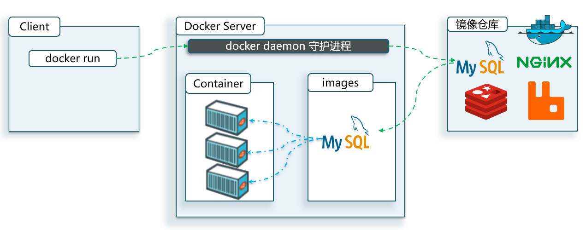

# Docker 部署 MySQL

## 一、MySQL 部署

一条命令部署 MySQL。

> `\` 用于换行。

```dockerfile
docker run -d \
  --name mysql \
  -p 3307:3306 \
  -e TZ=Asia/Shanghai \
  -e MYSQL_ROOT_PASSWORD=123 \
  mysql
```

以上这条命令，做了下图中的操作：



分析上面的命令，它从镜像仓库中，下载了 MySQL 的镜像，根据该镜像，构建了一个名为 mysql 的容器并运行。且创建了一个 root 用户，密码为 123。

- `docker run`：创建并运行一个容器，
- `-d` 选项，detached mode 的缩写，表示让容器在后台运行（`docker run` 命令和 `-d` 选项一般配套使用）。
- `--name mysql`：给容器起个名字，必须唯一。
- `-p 3307:3306` ：设置端口映射，将容器中的 3306 端口，映射到了宿主机的 3307 端口。
- `-e MYSQL_ROOT_PASSWORD=123` ：是设置环境变量（“KEY=VALUE”形式），由镜像决定要设置哪些环境变量。比如见 [MySQL 的官方镜像配置](https://hub.docker.com/_/mysql)。
- `mysql` ：指定运行的镜像的名字，默认表示最新的镜像版本，即 `mysql:latest`，完整写法是 `mysql:8.3.0`。
