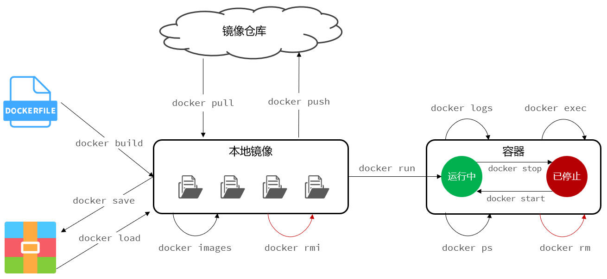

# Docker 常见命令

Docker 最常见的命令，就是操作镜像、容器的命令，详见[官方文档](https://docs.docker.com/)。以下例举几条常见的命令：

| 命令            | 说明                                                 |
| --------------- | ---------------------------------------------------- |
| docker pull   | 将镜像仓库中的镜像拉取到本地。                       |
| docker images | 查看本地镜像。                                       |
| docker rmi    | 删除本地镜像。                                       |
| docker build  | 根据 Dockerfile 构建镜像。                           |
| docker save   | 将镜像保存到本地，形成一个压缩文件。                 |
| docker load   | 将镜像的压缩文件，加载到本地的镜像中。               |
| docker push   | 将镜像推送到远程镜像仓库。                           |
| docker run    | 根据镜像创建并运行容器，如果镜像不存在，会自动从镜像 |
| docker stop   | 停止容器的进程，容器仍然存在。                       |
| docker start  | 启动容器的进程，不会创建新的容器（与 `docker         |
| docker ps     | 查看容器进程的运行状态。                             |
| docker rm     | 删除容器。                                           |
| docker logs   | 查看容器运行的日志。                                 |
| docker exec   | 进入容器。                                           |

这些命令的关系，如下图所示：

查看命令的具体用法，使用 `--help` 选项，比如：`docker save --help`。
