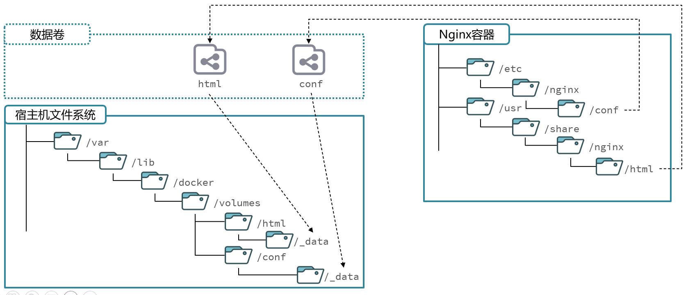

# Docker 数据卷挂载

## 一、数据卷

数据卷（volume）是容器内目录，与宿主机目录之间，映射的桥梁。用于操作容器内文件，方便迁移容器产生的数据。

以 Nginx 中的目录映射为例。默认宿主机目录，数据卷，与容器中目录的映射关系如下：



也就是说，默认情况下，数据卷存放在 `/var/lib/docker/volumes/` 目录下。

> 基于 WSL2 的 Windows Docker Desktop 数据卷，默认存放的位置需要在 `\\wsl$\docker-desktop-data\` 目录下查找。

Docker 数据卷的相关命令：

| **文档地址**                                                 | **说明**             |
| ------------------------------------------------------------ | -------------------- |
| [docker volume create](https://docs.docker.com/engine/reference/commandline/volume_create/) | 创建数据卷           |
| [docker volume prune](https://docs.docker.com/engine/reference/commandline/volume_prune/) | 清除数据卷           |
| [docker volume inspect](https://docs.docker.com/engine/reference/commandline/volume_inspect/) | 查看某个数据卷的详情 |
| [docker volume ls](https://docs.docker.com/engine/reference/commandline/volume_ls/) | 查看所有数据卷       |
| [docker volume rm](https://docs.docker.com/engine/reference/commandline/volume_prune/) | 删除指定数据卷       |

## 二、nginx 容器挂载数据卷

需求：① 创建 nginx 容器，其中的 html 目录下的 index.html 文件，查看变化；② 将静态资源，部署到 Nginx 的 html 目录。

因为 Docker 中的镜像，只提供了软件运行的必须环境，所以会发现，

- 容器环境中，没有 vim 编辑器。以修改静态资源 index.html；
- 也无法拷贝静态资源到容器的目录中，因为容器与宿主机是隔绝的。

Ⅰ、先删除 nginx 容器。执行命令：

```shell
docker rm nginx
```

Ⅱ、在创建 nginx 容器的同时，挂载数据卷。执行命令：

```shell
docker run -d \
    --name nginx \
    -p 80:80 \
    -v html:/usr/share/nginx/html \
    nginx
```

在执行 `docker run` 命令时，使用 `-v 数据卷:容器内目录` 参数，可以完成数据卷挂载。

上方命令，在创建并运行容器的同时，创建了一个名为 `html` 的数据卷，映射到容器中的 /usr/share/nginx/html 目录。

当创建容器时，如果挂载了数据卷，且数据卷不存在，会自动创建数据卷。

这里，我将数据卷挂载在自定义的目录下：

```shell
docker run -d \
    --name nginx \
    -p 80:80 \
    -v /home/zetian/dockerVolume/nginx/html:/usr/share/nginx/html \
    nginx
```

Ⅲ、查看创建的数据卷，执行命令：

```shell
docker volume ls
```

```shell
zetian@cqc1000015167l3:~$ docker volume ls
DRIVER    VOLUME NAME
local     c18b52b2e5a44f98189fe4b2be3fe1c7e47e6ad05a1a00680efbe5376934f33f
local     html
```

发现 html 数据卷已经被创建。

Ⅳ、查看该数据卷的详细信息。执行命令：

```shell
docker volume inspect html
```

```shell
zetian@cqc1000015167l3:~$ docker volume inspect html
[
    {
        "CreatedAt": "2024-04-11T05:58:25Z",
        "Driver": "local",
        "Labels": null,
        "Mountpoint": "/var/lib/docker/volumes/html/_data",
        "Name": "html",
        "Options": null,
        "Scope": "local"
    }
]
```

Ⅴ、修改数据卷中 index.html 文件。容器中对应的 index.html 文件也会改变。

Ⅵ、将静态资源，部署到数据卷中，覆盖其中的 index.html，查看效果。

## 三、mysql 容器挂载数据卷

查看 mysql 容器的详情。执行命令：

```shell
docker inspect mysql
```

查看到的 mysql 容器，数据卷挂载信息如下：

```json
{
  "Mounts": [
    {
      "Type": "volume",
      "Name": "c18b52b2e5a44f98189fe4b2be3fe1c7e47e6ad05a1a00680efbe5376934f33f",
      "Source": "/var/lib/docker/volumes/c18b52b2e5a44f98189fe4b2be3fe1c7e47e6ad05a1a00680efbe5376934f33f/_data",
      "Destination": "/var/lib/mysql",
      "Driver": "local",
      "Mode": "",
      "RW": true,
      "Propagation": ""
    }
  ]
}
```

根据上面的输出内容，我们发现 mysql 镜像在创建容器时，默认进行了数据卷的挂载。

- 这是为了将 mysql 保存的数据，映射到宿主机，避免 mysql 容器停止运行后，数据丢失。
- 也出于数据解耦的考虑，方便以后进行数据迁移

然而，mysql 容器默认挂载的数据卷，是一个匿名卷（c18b52b2e5a44f98189fe4b2be3fe1c7e47e6ad05a1a00680efbe5376934f33f 名字非常长）。

现在，要求基于宿主机目录（指定目录）实现 MySQL 数据目录、配置文件、初始化脚本的挂载。

查阅[官方镜像文档](https://hub.docker.com/_/mysql)后可知，它们对应的目录，分别是：

- 数据目录：/var/lib/mysql
- 配置文件目录：/etc/mysql/conf.d
- 初始化脚本目录：/docker-entrypoint-initdb.d（初始化脚本，在容器第一次启动时，才会生效，且只生效一次）

在执行创建容器命令前，提前在宿主机创建好以下三个目录：分别用于映射上面容器中的三个目录：

- /home/zetian/dockerVolume/mysql/data
- /home/zetian/dockerVolume/mysql/conf
- /home/zetian/dockerVolume/mysql/init

删除之前创建的 mysql 容器。执行命令：

```shell
docker stop mysql

docker rm mysql
```

创建 mysql 容器，并挂载数据卷。

```shell
docker run -d \
  --name mysql \
  -p 3307:3306 \
  -e TZ=Asia/Shanghai \
  -e MYSQL_ROOT_PASSWORD=123 \
  -v /home/zetian/dockerVolume/mysql/data:/var/lib/mysql \
  -v /home/zetian/dockerVolume/mysql/init:/docker-entrypoint-initdb.d \
  -v /home/zetian/dockerVolume/mysql/conf:/etc/mysql/conf.d \
  mysql
```

这里，我只把 mysql 的数据目录，挂载到自定义目录下。执行命令：

```shell
docker run -d \
  --name mysql \
  -p 3306:3306 \
  -e TZ=Asia/Shanghai \
  -e MYSQL_ROOT_PASSWORD=123 \
  -v /home/zetian/dockerVolume/mysql/data:/var/lib/mysql \
  mysql
```

## 四、数据卷补充

如果在启动 mysql 容器实例时，已挂载了数据目录的数据卷，则应在运行命令行中省略 `$MYSQL_ROOT_PASSWORD`；无论如何，该变量都将被忽略，并且不会以任何方式更改已存在的数据库。

要让宿主机中的映射目录，变为只读，在容器映射路径后面加上 `:ro`，表示 readonly：

```shell
docker run -d \
  --name mysql \
  -p 3306:3306 \
  -e TZ=Asia/Shanghai \
  -e MYSQL_ROOT_PASSWORD=123 \
  -v /home/zetian/dockerVolume/mysql/data:/var/lib/mysql:ro \
  mysql
```

声明数据卷里的某些文件夹，不同步到容器，比如 node 应用程序的容器中，可能会声明 node_modules 文件夹不同步到容器中。

```shell
docker run -d \
  --name mysql \
  -p 9000:9000 \
  -v /app/node_modules \
  mysql
```

强制删除容器，并删除相关的数据卷：

```doc
docker rm -fv 容器名
```
