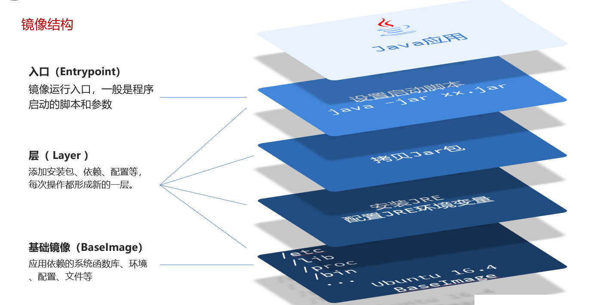

# Docker 自定义镜像

## 一、镜像是什么？

镜像（Image）就是包含了应用程序、程序运行的系统函数库、运行配置等文件的文件包。

构建镜像的过程，其实就是把上述文件打包的过程。

| 步骤 | 部署 Node 应用            | 构建 Node 镜像            |
| ---- | ------------------------- | ------------------------- |
| 1    | 准备一个 Linux 服务器     | 准备一个 Linux 运行环境   |
| 2    | 安装 Node，并配置环境变量 | 安装 Node，并配置环境变量 |
| 3    | 拷贝项目代码              | 拷贝项目代码              |
| 4    | 运行入口文件（main.js）   | 编写运行脚本              |

## 二、镜像的结构

以 Java 应用的镜像举例，其结构如下图所示：



镜像分层的好处：

- 共享，复用基础层，避免重复打包镜像。
- 有利于本地镜像文件的缓存。

## 三、Dockerfile

Dockerfile  是一个文本文件，其中包含一个个的指令（Instruction），用指令来说明要执行什么操作来构建镜像（告诉 Docker 镜像的结构。）。

将来 Docker 可以根据 Dockerfile 帮我们构建镜像。常见指令如下：

| 指令       | 说明                                             | 示例                                                         |
| ---------- | ------------------------------------------------ | ------------------------------------------------------------ |
| FROM       | 指定基础镜像                                     | FROM centos:6                                                |
| ENV        | 设置环境变量，可在后面指令中使用                 | ENV Key=Value                                                |
| COPY       | 拷贝本地文件到镜像的指定目录                     | COPY ./jre11.tar.gz /tmp                                     |
| RUN        | 执行 Linux 的 shell 命令，一般是安装过程的命令   | RUN tar -zxvf /tmp/jre11.tar.gz && EXPORTS path=/tmp/jre11:$path |
| EXPOSE     | 指定容器运行时监听的端口（是给镜像使用者看的）。 | EXPOSE 8080                                                  |
| ENTRYPOINT | 镜像中应用的启动命令，容器运行时调用             | ENTRYPOINT java -jar xx.jar                                  |

更新详细语法说明，请参考[官网文档](https://docs.docker.com/engine/reference/builder)。

我们可以基于 Ubuntu 基础镜像，利用 Dockerfile 描述镜像结构，也可以直接基于 JDK 为基础镜像，省略前面的步骤：

```dockerfile
# 指定基础镜像
FROM ubuntu:16.04
# 配置环境变量，JDK的安装目录、容器内时区
ENV JAVA_DIR=/usr/local
# 拷贝jdk和java项目的包
COPY ./jdk8.tar.gz $JAVA_DIR/
COPY ./docker-demo.jar /tmp/app.jar
# 安装JDK
RUN cd $JAVA_DIR \ && tar -xf ./jdk8.tar.gz \ && mv ./jdk1.8.0_144 ./java8
# 配置环境变量
ENV JAVA_HOME=$JAVA_DIR/java8
ENV PATH=$PATH:$JAVA_HOME/bin
# 入口，java项目的启动命令
ENTRYPOINT ["java", "-jar", "/app.jar"]
```

可以简化为 ↓

```dockerfile
# 基础镜像
FROM openjdk:11.0-jre-buster
# 拷贝jar包
COPY docker-demo.jar /app.jar
# 入口
ENTRYPOINT ["java", "-jar", "/app.jar"]
```

运行命令，构建镜像：

```shell
docker build -t myImage:1.0 .
```

- `-t` 选项，是给镜像起名，格式依然是 repository:tag 的格式，不指定 tag 时，默认为 `latest``。
- `.` ：表示指定 Dockerfile 所在目录为当前目录。
