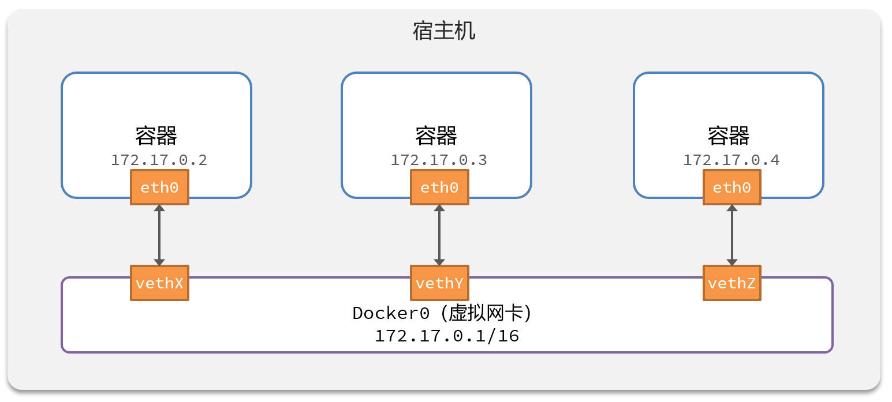

# Docker 网络

## 一、Docker 网络是什么？

默认情况下，所有容器都是以 bridge 方式，连接到 Docker 的一个虚拟网卡上：



查看 mysql 容器的网络配置，执行命令：

```shell
docker inspect mysql
```

```json
{
  "Networks": {
      "bridge": {
          "IPAMConfig": null,
          "Links": null,
          "Aliases": null,
          "MacAddress": "02:42:ac:11:00:02",
          "NetworkID": "9f6ed30840542d7409e6cf14aa78440dfec834bdf773d4e5ebc7319e031c5b87",
          "EndpointID": "d4407231d5536dcba121986a3c532d314bfa98b67a1e675849bd334726916653",
          "Gateway": "172.17.0.1",
          "IPAddress": "172.17.0.2",
          "IPPrefixLen": 16,
          "IPv6Gateway": "",
          "GlobalIPv6Address": "",
          "GlobalIPv6PrefixLen": 0,
          "DriverOpts": null,
          "DNSNames": null
      }
  }
}
```

发现 mysql 容器，处在 `172.17.0.1` 网卡中。

我们知道，容器之间，可以通过 ip 地址互相访问，但这种连接方式不好，因为停止容器再启动后，容器的 ip 地址是动态变化的。

解决该问题的方法，就是将容器，加入 Docker 的自定义网络，这样，容器就可以通过容器名互相访问了。

Docker 的网络操作命令如下：

| 命令                                                         | **说明**                 |
| ------------------------------------------------------------ | ------------------------ |
| [docker network create](https://docs.docker.com/engine/reference/commandline/network_create/) | 创建一个网络             |
| [docker network rm](https://docs.docker.com/engine/reference/commandline/network_rm/) | 删除指定网络             |
| [docker network prune](https://docs.docker.com/engine/reference/commandline/network_prune/) | 清除未使用的网络         |
| [docker network connect](https://docs.docker.com/engine/reference/commandline/network_connect/) | 使指定容器连接加入某网络 |
| [docker network disconnect](https://docs.docker.com/engine/reference/commandline/network_disconnect/) | 使指定容器连接离开某网络 |
| [docker network ls](https://docs.docker.com/engine/reference/commandline/network_ls/) | 查看所有网络             |
| [docker network inspect](https://docs.docker.com/engine/reference/commandline/network_inspect/) | 查看网络详细信息         |

## 二、Docker 网络创建

创建 docker 的 `zetian` 网卡，执行命令：

```shell
docker network create zetian
```

将 mysql 容器，连接到 zetian 网卡

```shell
docker network connect zetian mysql
```

也可以在容器创建时，直接将容器连接到网络，执行命令：

```shell
docker run --network 网卡名 容器名
```

在同一自定义网络下的其它容器中，可以使用 mysql 容器名，直接访问 mysql 容器，执行命令：

```shell
ping mysql
```

## 三、Docker 容器访问宿主机

以 docker 容器中的 Nginx 为例

Nginx 反向代理到宿主机端口上的应用程序，常见的做法是使用 Docker 提供的一些特殊网络配置。具体做法取决于你的 Docker 版本和配置。

以下是几种常见的方法：

### 3.1. host.docker.internal（推荐）

在现代的 Docker 版本中，Docker 提供了一个特殊的 DNS 名称 `host.docker.internal`，它让容器能够访问宿主机上的服务。

配置步骤

1.**修改 Nginx 配置**： 假设宿主机的服务在 `8080` 端口运行，修改 `nginx.conf` 文件中的 `proxy_pass` 配置，使用 `host.docker.internal` 来指向宿主机。

```nginx
location /api/ {
    proxy_pass http://host.docker.internal:8080/;
}
```

2.**重启 Nginx 容器**： 修改完配置后，重启 Nginx 容器以应用配置：

```bash
docker exec -it my-nginx nginx -s reload
```
