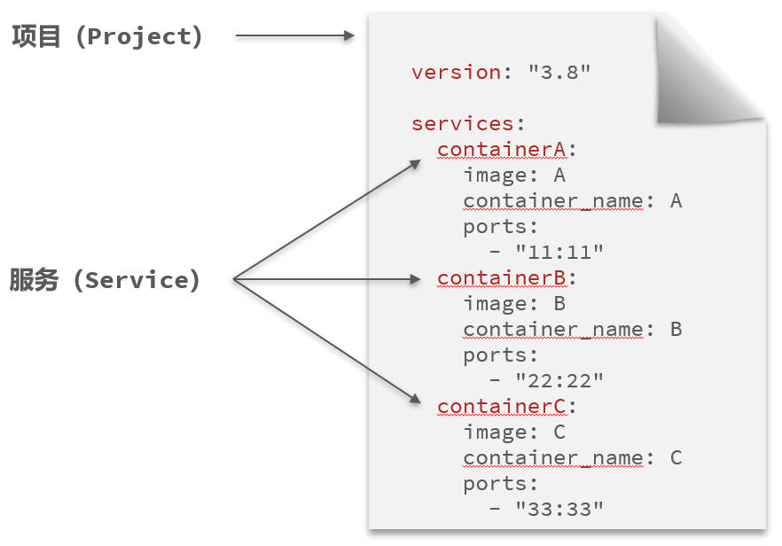

# DockerCompose

## 一、Docker compose 是什么？

Docker Compose 通过一个单独的 `docker-compose.yml` 模板文件（YAML 格式）来定义一组相关联的应用容器，帮助我们实现多个相互关联的 Docker 容器的快速部署。

可做项目的一键部署，模拟多台服务器集群部署。


Docker Compose 配置文件的结构如下图所示：



因为 docker compose 本身就是用来创建镜像，并运行、启动容器的。

所以 `docker run` 命令的参数、选项内容，与 `docker-compose.yml` 配置文件中描述的内容，几乎一样。以下是它们的对比：

`docker run` 命令：

```shell
docker run -d \
  --name mysql \
  -p 3306:3306 \
  -e TZ=Asia/Shanghai \
  -e MYSQL_ROOT_PASSWORD=123 \
  -v ./mysql/data:/var/lib/mysql \
  -v ./mysql/conf:/etc/mysql/conf.d \
  -v ./mysql/init:/docker-entrypoint-initdb.d \
  --network hmall
  mysql
```

`docker-compose.yml` 配置文件：

```yaml
version: '3.8'

services:
  mysql:
    image: mysql
    container_name: mysql
    ports:
      - '3306:3306'
    environment:
      TZ: Asia/Shanghai
      MYSQL_ROOT_PASSWORD: 123
    volumes:
      - './mysql/data:/var/lib/mysql'
      - './mysql/conf:/etc/mysql/conf.d'
      - './mysql/init:/docker-entrypoint-initdb.d'
    networks:
      - hmall
```

## 二、Docker Compose 配置

使用 docker-compose.yml 配置文件，部署一个 Java 项目。

```yaml
version: '3.8'

services:
  mysql:
    image: mysql
    container_name: mysql
    ports:
      - '3306:3306'
    environment:
      TZ: Asia/Shanghai
      MYSQL_ROOT_PASSWORD: 123
    volumes:
      - './mysql/conf:/etc/mysql/conf.d'
      - './mysql/data:/var/lib/mysql'
      - './mysql/init:/docker-entrypoint-initdb.d'
    networks:
      - new
  hmall:
    build:
      context: .
      dockerfile: Dockerfile
    container_name: hmall
    ports:
      - '8080:8080'
    networks:
      - new
    depends_on:
      - mysql
  nginx:
    image: nginx
    container_name: nginx
    ports:
      - '18080:18080'
      - '18081:18081'
    volumes:
      - './nginx/nginx.conf:/etc/nginx/nginx.conf'
      - './nginx/html:/etc/nginx/html'
    depends_on:
      - hmall
    networks:
      - new
networks:
  new:
    name: hmall
```

## 三、Docker 命令

docker compose 相关的 docker 命令语法：`docker compose [OPTIONS] [COMMAND]`。

选项：

| 选项 | 说明                                                         |
| ---- | ------------------------------------------------------------ |
| -f   | 指定 compose 文件的路径和名称（不指定，表示使用当前目录的 `docker-compose.yml` 文件） |
| -p   | 指定 project 名称                                            |

参数：

| 参数    | 说明                                      |
| ------- | ----------------------------------------- |
| up  | 创建镜像，并启动、运行所有容器 |
| down    | 停止并移除所有容器、网络                  |
| ps      | 列出所有启动的容器                        |
| logs    | 查看指定容器的日志                        |
| stop    | 停止容器                                  |
| start   | 启动容器                                  |
| restart | 重启容器                                  |
| top     | 查看运行的进程                            |
| exec    | 在指定的运行容器中执行命令              |

一条命令，构建镜像，并启动运行容器，

- `-d` 选项，表示且在后台运行；
- `--build` 选项，表示根据最新的镜像重建：

```shell
docker compose up -d --build
```

清除容器，并清除对应的数据卷。

```shell
dcoker compose down -v
```
